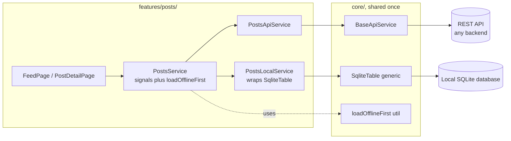
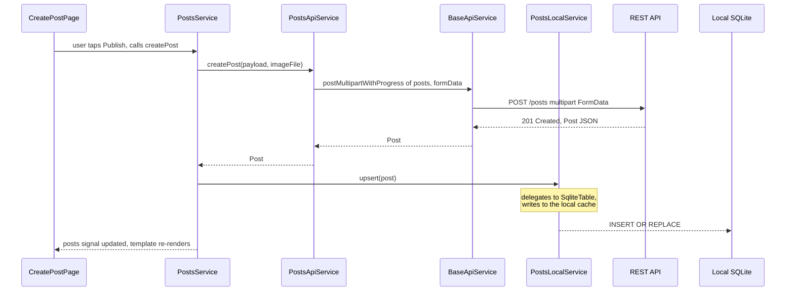

Pulse Feed App Tutorial (`pulse-feed-app`)

A complete, hands-on walkthrough of building a well-architected Ionic/Angular mobile app with **Angular** (standalone components, Signals) and **Ionic 8**, organized into Git branches that each cover a well-scoped concern, deliberately chosen so the tutorial also exercises a broad set of Angular/Ionic concepts along the way.

Pulse Feed App is a social feed app: users sign up, sign in, post, comment, and like. Its internal structure follows idiomatic Angular conventions: feature folders with co-located files, concrete injectable services, and Signals for state.

The app is **backend-agnostic**: it talks to a plain REST API over HTTP via Angular's `HttpClient`. Any backend that implements the API Contract below works. This tutorial does not ship a backend; it assumes one already exists or is built separately.

This document is the **complete specification** of the mobile client. It is meant to be followed step by step, branch by branch.

---

## Prerequisites

- Node.js LTS and a package manager (`npm`, `pnpm`, or `yarn`) installed
- Angular CLI and Ionic CLI installed globally (`npm i -g @angular/cli @ionic/cli`)
- Comfortable with core TypeScript syntax (classes, interfaces, `async`/`await`, generics)
- Xcode (iOS) and/or Android Studio set up if you intend to run on a simulator/emulator or a physical device via Capacitor; the web target needs neither
- A backend implementing the [API Contract](#api-contract), reachable from the browser/device/emulator running the app
- No prior experience with Ionic, Capacitor, Angular Signals, or RxJS is required; each is introduced from scratch

---

## Table of Contents

- [Tech Stack](#tech-stack)
- [Concept Map](#concept-map)
- [Non-Goals](#non-goals)
- [Domain Model](#domain-model)
- [API Contract](#api-contract)
- [Auth Model](#auth-model)
- [Architecture](#architecture)
  - [Offline scope](#offline-scope)
  - [Reconciling writes made offline](#reconciling-writes-made-offline)
- [Branching Strategy](#branching-strategy)
- [Project Structure](#project-structure)
- [Error Handling](#error-handling)
- [Git Commit Convention](#git-commit-convention)
- [feature/core-architecture](#featurecore-architecture)
- [feature/design-system](#featuredesign-system)
- [feature/data-modeling](#featuredata-modeling)
- [feature/offline-and-sync](#featureoffline-and-sync)
- [feature/auth](#featureauth)
- [feature/users](#featureusers)
- [feature/posts](#featureposts)
- [feature/comments](#featurecomments)
- [feature/likes](#featurelikes)
- [feature/quality-and-release](#featurequality-and-release)
- [feature/integrations (bonus)](#featureintegrations-bonus)
- [Order of Work](#order-of-work)
- [Code Conventions](#code-conventions)
- [Concepts Covered](#concepts-covered)
- [Troubleshooting](#troubleshooting)
- [Contributing](#contributing)
- [License](#license)
- [How to Follow This Tutorial](#how-to-follow-this-tutorial)

---

## Tech Stack

| Package | Role | What it actually does |
|---|---|---|
| `@ionic/angular` | UI framework | Provides Ionic's mobile-first UI components (`ion-list`, `ion-card`, `ion-modal`, `ion-refresher`...) as Angular standalone components, plus platform-adaptive styling (iOS vs Material). |
| `@angular/core` | App framework | Standalone components, dependency injection, Signals (`signal`, `computed`, `effect`), and change detection. |
| `@angular/common/http` | HTTP client | Sends every REST request (GET/POST/PATCH/DELETE) to the backend as an `Observable`; supports functional interceptors and typed responses. |
| `@angular/router` | Navigation | Declarative routes, route guards (`CanActivateFn`), route parameters, lazy-loaded feature routes. |
| `@angular/forms` | Forms | Reactive Forms: `FormGroup`, `FormControl`, validators, typed forms. |
| `@angular/animations` | Animations | Angular's animation DSL (`trigger`/`state`/`transition`/`style`) for explicit, state-driven animations. |
| `@capacitor/core` | Native bridge | Lets the same Angular/Ionic codebase run as a native iOS/Android app (via native WebView) in addition to the web, and exposes native APIs to JavaScript. |
| `@capacitor-community/sqlite` | Local database | SQLite bindings for Capacitor; stores a local, queryable cache of posts and comments so the app has data to show when offline. |
| `@capacitor/network` | Network awareness | Reports the device's current connectivity status, used to show the offline banner and to decide whether a service reads from the network or the local cache. |
| `capacitor-secure-storage-plugin` | Token storage | Stores the access and refresh JWTs in the platform's secure storage (Keychain on iOS, Keystore on Android) instead of `localStorage`. |
| `@capacitor/camera` | Media selection | Opens the camera or photo gallery to select an image (avatar, post image). |
| `@capacitor/filesystem` | File caching | Caches downloaded post/avatar images to disk so they render instantly and remain available offline. |
| `@ngx-translate/core` | Internationalization | Loads translation JSON files and swaps the active language at runtime, without a full app rebuild per locale. |
| `zod` | Runtime validation | Validates API responses at the HTTP boundary, so a malformed payload becomes a typed error instead of a silent `undefined`. |
| `@capacitor-community/google-signin` | Social login (bonus) | Drives the native Google account picker and returns an ID token to exchange with the backend. |
| `@capacitor/push-notifications` | Push notifications (bonus) | Registers the device for push (via FCM/APNs under the hood), receives the device push token, and delivers foreground/background messages. |
| `@capacitor/local-notifications` | Local notification display (bonus) | Renders a system notification when a push message arrives while the app is in the foreground. |
| Karma + Jasmine | Test runner | The Angular CLI's default unit/component test setup (`ng test`): Jasmine provides the assertion/spy API, Karma runs specs in a real browser. |
| `TestBed` (`@angular/core/testing`) | Component testing | Angular's built-in harness for configuring a testing module, creating a `ComponentFixture`, and querying/interacting with rendered components. |
| `@angular/common/http/testing` | HTTP test double | `provideHttpClientTesting()` + `HttpTestingController` intercept `HttpClient` requests in tests and return canned responses, so services run without a real backend. |
| `playwright` | End-to-end testing | Drives the full app (real browser, real navigation) in black-box tests, including the web build. |
| `eslint` + `angular-eslint` | Static analysis | Lint rule set enforced by `ng lint` and the CI pipeline. |

---

## Concept Map

This is not a per-branch mapping: which concept ends up in which branch depends on how each feature is actually implemented. This table is a coverage target for the whole tutorial. When implementing any branch, prefer the approach that exercises one of these concepts over the shortest path to a working feature.

| Area | Concepts |
|---|---|
| Components | Standalone components, `@Input`/`@Output`, `ChangeDetectionStrategy.OnPush`, content projection (`ng-content`) |
| Reactivity | Signals (`signal`, `computed`, `effect`), `toSignal`/`toObservable` bridging RxJS and Signals |
| Theming | Ionic CSS variables/design tokens, light/dark mode (`prefers-color-scheme`), platform-adaptive styling (iOS vs Material) |
| Layout | Ionic grid (`ion-grid`/`ion-row`/`ion-col`), responsive breakpoints, `ResizeObserver` for adaptive layout |
| Navigation | Angular Router, lazy-loaded routes, route guards (`CanActivateFn`), route parameters, Ionic's `ion-router-outlet` and back-navigation stack |
| Dependency injection | Angular's built-in DI, `providedIn: 'root'` vs route-scoped providers, `inject()` function, constructor injection of concrete services |
| RxJS and async | `Observable`, operators (`map`, `switchMap`, `catchError`, `retry`), `firstValueFrom`, converting `Observable` to `Signal` |
| Forms | Reactive Forms, typed `FormGroup`, custom validators, form state (`dirty`/`touched`/`errors`) |
| HTTP networking | `HttpClient`, functional interceptors, typed requests/responses, multipart upload, request cancellation via `takeUntilDestroyed` |
| Auth token lifecycle | JWT access/refresh tokens, secure storage, automatic header injection, 401 handling and refresh |
| Local persistence | `@capacitor-community/sqlite` schema/migrations, read-through and write-through caching, offline-first services |
| Media | `@capacitor/camera`, multipart upload with progress, `@capacitor/filesystem` image caching |
| Lists and scrolling | `@for` with `track`, `ion-infinite-scroll`, cursor-based pagination, `ion-refresher` |
| Animations | Ionic page transitions, Angular Animations API (explicit `trigger`/`transition`), CSS transitions (implicit) |
| Keyboard and viewport | Ionic keyboard handling, `ion-modal`/`ion-action-sheet`, safe-area insets |
| Optimistic UI | Immediate signal update ahead of server confirmation, reconciliation with real state, rollback on failure |
| Network and offline | Connectivity detection, local SQLite cache, offline UX states, queued writes, temporary-id reconciliation for entities created offline |
| Accessibility | ARIA roles/labels, focus management, dynamic text scaling, Ionic's built-in accessibility support |
| Internationalization | `@ngx-translate/core`, runtime language switching, pluralization |
| Third-party auth | OAuth/social sign-in flow, exchanging a provider token for app-issued tokens |
| Push notifications | Device token registration, foreground/background message handling, local notification display |
| Testing | Unit, component, and end-to-end tests |

---

## Non-Goals

To keep the scope honest, this tutorial deliberately does not cover:

- Real-time updates over WebSockets or Server-Sent Events; the feed and comments are refreshed via pull-to-refresh and pagination, not a live socket
- An admin panel or moderation tooling
- Payments, subscriptions, or any monetization flow
- Multi-tenant or organization-level accounts; the domain model is a single flat user base
- End-to-end encryption of post/comment content
- A production-grade backend implementation; the [API Contract](#api-contract) is the client's expectation, building a backend that satisfies it is a separate exercise
- Server-side rendering (Angular Universal); the app targets a client-rendered SPA shipped through Capacitor and, optionally, a static web build
- NgRx or any global store library; Signals plus a handful of feature services are enough at this app's scale, and introducing a store adds ceremony this tutorial does not need

---

## Domain Model

Expressed here as plain TypeScript types.

```
users (id, displayName, email, photoUrl, createdAt)
    │ 1
    │
    │ N
posts (id, authorId, title, content, imageUrl, createdAt, commentsCount, likesCount)
    │ 1                              │ 1
    │                                │
    │ N                              │ N
comments (id, postId, authorId,   likes (userId, postId, createdAt)
          content, createdAt)
```

| Type | Key fields |
|---|---|
| `User` | id, displayName, email, photoUrl, createdAt |
| `Post` | id, authorId, authorName, authorPhotoUrl, title, content, imageUrl, createdAt, updatedAt, commentsCount, likesCount, isLikedByMe |
| `Comment` | id, postId, authorId, authorName, authorPhotoUrl, content, createdAt |
| `Like` | userId, postId, createdAt |

`isLikedByMe` is never sent as raw client state; it is either returned by the API on `GET /posts` or derived from a separate `GET /posts/:id/likes/me` call, depending on the backend's contract.

Prefer including `isLikedByMe` directly in the `GET /posts` response when designing the backend: deriving it via one `GET /posts/:id/likes/me` call per card in the feed is an N+1 pattern that does not scale past a handful of posts. The separate endpoint is still useful for a single post detail page load.

### Local-only fields (never sent to the API)

`PostsLocalService` and `CommentsLocalService` cache rows shaped as `PostRow`/`CommentRow`: the corresponding API type (`Post`/`Comment`) plus two fields that exist only on-device and are stripped before anything is sent over HTTP:

```typescript
// features/posts/post.model.ts
export interface PostRow extends Post {
  pendingSync: boolean; // true while a create/update/delete made offline hasn't reached the API yet
}
```

A post or comment created while offline does not have a server-issued `id` yet: `id` is temporarily set to a client-generated value (`temp-<uuid>`) until the write syncs and the server's real `id` replaces it everywhere the row is cached or displayed. See [Reconciling writes made offline](#reconciling-writes-made-offline) for how that replacement happens.

---

## API Contract

Any backend consumed by this app must expose the following REST surface. Paths are relative to a configurable `API_BASE_URL`.

### Auth

| Method | Path | Body | Response |
|---|---|---|---|
| POST | `/auth/register` | `{ email, password, displayName }` | `{ accessToken, refreshToken, user }` |
| POST | `/auth/login` | `{ email, password }` | `{ accessToken, refreshToken, user }` |
| POST | `/auth/refresh` | `{ refreshToken }` | `{ accessToken }` |
| POST | `/auth/logout` | `{ refreshToken }` | `204 No Content` |
| POST | `/auth/google` | `{ idToken }` | `{ accessToken, refreshToken, user }` (bonus, see `feature/integrations`) |

### Users

| Method | Path | Body | Response |
|---|---|---|---|
| GET | `/users/:id` | - | `User` |
| PATCH | `/users/me` | `{ displayName? }` | `User` |
| POST | `/users/me/avatar` | multipart `file` | `{ photoUrl }` |

### Posts

| Method | Path | Body | Response |
|---|---|---|---|
| GET | `/posts?cursor=&limit=` | - | `{ items: Post[], nextCursor }` |
| GET | `/posts/:id` | - | `Post` |
| POST | `/posts` | multipart: `title`, `content`, `image?` | `Post` |
| PATCH | `/posts/:id` | `{ title?, content? }` | `Post` |
| DELETE | `/posts/:id` | - | `204 No Content` |

### Comments

| Method | Path | Body | Response |
|---|---|---|---|
| GET | `/posts/:postId/comments?cursor=&limit=` | - | `{ items: Comment[], nextCursor }` |
| POST | `/posts/:postId/comments` | `{ content }` | `Comment` |
| DELETE | `/comments/:id` | - | `204 No Content` |

### Likes

| Method | Path | Body | Response |
|---|---|---|---|
| POST | `/posts/:postId/likes` | - | `{ liked: boolean, likesCount: number }` (toggles) |
| GET | `/posts/:postId/likes/me` | - | `{ liked: boolean }` |

### Devices (bonus, push notifications)

| Method | Path | Body | Response |
|---|---|---|---|
| POST | `/devices` | `{ pushToken, platform }` | `204 No Content` |
| DELETE | `/devices/:pushToken` | - | `204 No Content` |

All authenticated endpoints expect `Authorization: Bearer <accessToken>`. A `401` response triggers the client's refresh-token flow (see [Auth Model](#auth-model)); if the refresh also fails, the user is signed out.

---

## Auth Model

Authentication is stateless and token-based (JWT), independent of any specific backend implementation.

| Concern | Handled by |
|---|---|
| Credential validation, password hashing | The backend (out of scope for this client) |
| Access token | Short-lived JWT, sent as `Authorization: Bearer <token>` on every authenticated request |
| Refresh token | Longer-lived token, stored securely, exchanged for a new access token via `POST /auth/refresh` |
| Token storage | `capacitor-secure-storage-plugin` on native (Keychain on iOS, Keystore on Android); on the web build, no equivalent hardware-backed store exists, so tokens fall back to `IndexedDB` and that build is not held to the same security bar. Never `localStorage` on any platform. |
| Automatic header injection | A functional `HttpInterceptorFn` attaches the current access token to outgoing requests |
| Expired token handling | The same interceptor catches `401`, attempts a silent refresh, retries the original request once, and signs the user out if the refresh also fails. Concurrent `401`s share a single in-flight refresh call rather than each triggering their own. |
| Session restoration on app start | An `APP_INITIALIZER` reads the stored tokens; if present and valid, restores the authenticated state before the app renders its first route |
| Route protection | A `CanActivateFn` guard reading `AuthService.isAuthenticated` (a computed signal) |
| Third-party sign-in (bonus) | Google ID token exchanged for app tokens via `POST /auth/google`; the resulting session is indistinguishable from a password-based one afterward |

---

## Architecture

Each feature is a flat folder of concrete, injectable Angular services and standalone components, which is how most real-world Angular/Ionic apps are actually structured. The separation of concerns that matters is still there, it is just expressed through **what each service is responsible for**, not through folder layers.

### The service triad per data-backed feature

| Service | Responsibility | Depends on |
|---|---|---|
| `<Feature>ApiService` | Talks to the backend. One method per endpoint. Returns typed `Observable`s. Knows nothing about SQLite or UI state. | `BaseApiService` |
| `<Feature>LocalService` | Talks to the local SQLite cache for this feature. Knows nothing about HTTP or UI state. | `AppDatabaseService`, `SqliteTable<T>` |
| `<Feature>Service` | The facade a component actually injects. Holds the feature's state as Signals, orchestrates the offline-first strategy, and exposes plain methods (`loadPosts()`, `createPost()`) that components call. | `<Feature>ApiService`, `<Feature>LocalService`, `loadOfflineFirst`, `SyncService` (for features with queueable mutations) |

Components only ever depend on the facade service. They never inject an `ApiService` or a `LocalService` directly, and they never call `HttpClient` or the SQLite plugin themselves.

### Three shared building blocks, so the triad above stays thin

Without these, every `<Feature>ApiService`, `<Feature>LocalService`, and `<Feature>Service` would re-implement the same plumbing. Each one exists specifically to be called, not extended: composition over inheritance, consistent with how services are used everywhere else in this app.

| Shared piece | Lives in | Used by | Prevents repeating |
|---|---|---|---|
| `BaseApiService` | `core/http/base-api.service.ts` | Every `<Feature>ApiService` | Base URL prefixing, query param handling, multipart upload with progress, `zod` schema validation, and `HttpErrorResponse` -> `AppError` mapping on every call |
| `SqliteTable<T>` | `core/database/sqlite-table.ts` | Every `<Feature>LocalService` | The `INSERT OR REPLACE` / `SELECT` / `DELETE` SQL boilerplate that is identical across `posts_cache`, `comments_cache`, and any future cached table |
| `loadOfflineFirst()` | `core/offline/offline-first.util.ts` | Every `<Feature>Service`'s `loadX()` method | The remote-then-cache-fallback-then-write-through sequence itself, so it is written once instead of once per feature |

`BaseApiService` and `AppDatabaseService` are Angular-injectable singletons (`providedIn: 'root'`). `SqliteTable<T>` is instantiated directly inside a `<Feature>LocalService`'s constructor (it needs per-table configuration a DI token is not a natural fit for); `loadOfflineFirst()` is a plain function, not a service, since it has no state of its own.



Angular's DI provides every service as a singleton (`providedIn: 'root'`, or scoped to the feature's lazy route if it should not outlive that route). There is no abstract class or injection token standing in for an interface: Angular can already substitute a different implementation in tests via `TestBed.overrideProvider`, so introducing an abstraction layer purely for that purpose would add ceremony without a corresponding benefit at this app's size.

### A concrete request: creating a post



If the `POST /posts` call fails with a network error, `PostsService` decides what happens next by calling the shared `SyncService.enqueue(...)` (see `feature/offline-and-sync`) to queue the write, rather than each feature service inventing its own queuing logic. `PostsApiService` and `PostsLocalService` stay dumb and single-purpose; `BaseApiService` and `SqliteTable` stay generic and reusable. Swapping the backend, or replacing `HttpClient` with another transport, only touches `BaseApiService`.

Rule of thumb: if a component ends up calling `this.http.get(...)` or a SQLite query directly, that is the signal the facade service is being bypassed. If two `<Feature>ApiService` files start looking similar to each other, that is the signal something belongs in `BaseApiService` instead.

### Offline scope

Not every feature behaves the same way when the device is offline. Being explicit about this now avoids discovering the gaps mid-implementation:

| Feature | Reads while offline | Writes while offline |
|---|---|---|
| Posts | Served from `posts_cache` via `loadOfflineFirst` | Queued via `SyncService`, shown optimistically with a pending indicator |
| Comments | Served from `comments_cache` via `loadOfflineFirst` | Queued via `SyncService`, shown optimistically with a pending indicator |
| Likes | Rides along with the cached `Post.likesCount`/`isLikedByMe`, no separate cache table | Queued via `SyncService`, no reconciliation needed (see below) |
| Auth | Session restoration works offline (stored tokens); sign in/up/out require connectivity | Not applicable |
| Users (profile view/edit, avatar upload) | Requires connectivity; no `users_cache` table | Requires connectivity, not queued |

Profile viewing and editing were deliberately left out of the offline-first strategy: caching every profile a user has ever viewed has a much less favorable cost/benefit than caching the feed and its comments, which are the screens someone is actually likely to open while disconnected. If a later branch wants to extend offline support to profiles, it follows the exact same three-piece pattern (`UsersLocalService` composed from `SqliteTable<UserRow>`, `loadOfflineFirst` in `UsersService`) documented here.

### Reconciling writes made offline

Queuing a write is not enough by itself: `SyncService.enqueue(...)` durably records the intent, but replaying it later needs to know **how** to call the right API method, and, for a `create`, how to replace the temporary client-generated `id` with the real one the server assigns once the write succeeds. `SyncService` does not know this itself for every entity type; each feature registers a small reconciler that does.

```typescript
// core/offline/sync.service.ts
export interface PendingWriteReconciler<T> {
  entityType: string;
  replay: (payload: unknown) => Observable<T>;
  onSynced: (tempId: string, synced: T) => Promise<void>;
}

@Injectable({ providedIn: 'root' })
export class SyncService {
  private readonly reconcilers = new Map<string, PendingWriteReconciler<unknown>>();

  register<T>(reconciler: PendingWriteReconciler<T>): void {
    this.reconcilers.set(reconciler.entityType, reconciler as PendingWriteReconciler<unknown>);
  }

  async enqueue(entityType: string, operation: 'create' | 'update' | 'delete', payload: unknown, tempId?: string): Promise<void> {
    // persists one row into the pending_writes table (see feature/offline-and-sync)
  }

  // called once ConnectivityService.isOnline flips to true
  private async replayAll(): Promise<void> {
    // reads pending_writes in order; for each row, looks up the reconciler
    // registered for that entity_type, calls replay(), and on success calls
    // onSynced(tempId, result) before deleting the row. Leaves the row queued
    // (and stops) on any failure, so writes never replay out of order.
  }
}
```

`PostsService` registers its reconciler once, typically in its constructor:

```typescript
// features/posts/posts.service.ts
constructor() {
  this.sync.register<Post>({
    entityType: 'post',
    replay: (payload) => this.api.createPost(payload as CreatePostPayload),
    onSynced: async (tempId, post) => {
      await this.local.replaceId(tempId, post);
      this.state.update((s) => s.status === 'success'
        ? { ...s, data: s.data.map((p) => (p.id === tempId ? post : p)) }
        : s);
    },
  });
}

createPost(payload: CreatePostPayload): void {
  this.api.createPost(payload).subscribe({
    next: (post) => this.local.upsert({ ...post, pendingSync: false }),
    error: (error: AppError) => {
      if (error.kind !== 'network') { /* surface the error, do not queue */ return; }
      const tempId = `temp-${crypto.randomUUID()}`;
      const optimisticPost: PostRow = { ...payload, id: tempId, pendingSync: true, /* ... */ };
      this.local.upsert(optimisticPost);
      this.state.update((s) => s.status === 'success' ? { ...s, data: [optimisticPost, ...s.data] } : s);
      this.sync.enqueue('post', 'create', payload, tempId);
    },
  });
}
```

`CommentsService` follows the exact same shape for `addComment()`. `LikesService` does **not** need a reconciler: toggling a like never creates a new server-generated identifier, the composite key (`userId`, `postId`) is already known on the client before the request is even sent, so `SyncService.enqueue('like', 'update', payload)` with no `tempId` and no `onSynced` callback is sufficient.

A post or comment still carrying a temporary `id` (`pendingSync: true`) cannot be edited or deleted: `PostCardComponent`/`CommentTileComponent` hide those actions and show a small pending indicator instead, until `onSynced` replaces the temporary row.

---

## Branching Strategy

Branches are grouped around a cohesive deliverable (a resource, or a well-defined cross-cutting concern), not split down to every individual technical sub-topic. Concept coverage is tracked separately in the [Concept Map](#concept-map); the goal of each branch's task list is to touch as many of those concepts as the feature naturally allows.

| Branch | Role |
|---|---|
| `master` | Stable, production-ready code. No direct commits, only merges from `develop`. |
| `develop` | Integration branch. |
| `feature/core-architecture` | Project structure, Capacitor setup, `HttpClient` configuration, environment config, router scaffold, CI. |
| `feature/design-system` | Ionic theming (light/dark, CSS variables), typography and spacing tokens, responsive layout primitives, reusable standalone components. |
| `feature/data-modeling` | TypeScript types, DTO mapping helpers, the shared `AppError` shape. |
| `feature/offline-and-sync` | Capacitor SQLite schema and migrations, the offline-first service pattern, connectivity detection, offline banner wiring. |
| `feature/auth` | Registration, login, logout, JWT/refresh token lifecycle, secure storage, route guard. |
| `feature/users` | User profile view/edit, avatar upload, accessibility pass on the profile pages. |
| `feature/posts` | Full post lifecycle: feed, pagination, detail, create/edit/delete, image upload, animations. |
| `feature/comments` | Comments list, creation, deletion, keyboard/viewport handling. |
| `feature/likes` | Optimistic UI toggle, explicit animation. |
| `feature/quality-and-release` | App-wide accessibility and i18n pass, full test suite (component, e2e), app icons/splash, release pipeline. |
| `feature/integrations` | Bonus: sign in with Google, push notifications via Capacitor/FCM. |

Each feature branch ends with a Pull Request to `develop`. Each PR must include atomic commits (one per file), a completed task list, and passing tests.

---

## Project Structure

```
pulse-feed-app/
├── .github/workflows/            # CI: lint, test, build
├── android/ ios/                 # Capacitor native projects (generated)
├── src/
│   ├── assets/
│   │   └── i18n/
│   │       ├── en.json
│   │       └── fr.json
│   ├── environments/
│   │   ├── environment.ts
│   │   └── environment.prod.ts
│   ├── main.ts
│   └── app/
│       ├── app.component.ts
│       ├── app.component.spec.ts
│       ├── app.routes.ts
│       ├── app.config.ts               # providers, interceptors, APP_INITIALIZER
│       ├── core/
│       │   ├── http/
│       │   │   ├── api-endpoints.ts    # path constants matching the API Contract
│       │   │   ├── base-api.service.ts # shared GET/POST/PATCH/DELETE/multipart + error mapping
│       │   │   ├── base-api.service.spec.ts
│       │   │   ├── auth.interceptor.ts # attaches token, handles 401 + refresh
│       │   │   ├── auth.interceptor.spec.ts
│       │   │   ├── http-error.util.ts  # maps HttpErrorResponse to AppError, used only by BaseApiService
│       │   │   └── http-error.util.spec.ts
│       │   ├── storage/
│       │   │   ├── secure-token-storage.service.ts
│       │   │   └── secure-token-storage.service.spec.ts
│       │   ├── database/
│       │   │   ├── app-database.service.ts   # Capacitor SQLite instance, migrations
│       │   │   ├── app-database.service.spec.ts
│       │   │   ├── sqlite-table.ts           # generic table CRUD, composed by every *LocalService
│       │   │   └── sqlite-table.spec.ts
│       │   ├── models/
│       │   │   └── app-error.ts
│       │   ├── network/
│       │   │   ├── connectivity.service.ts
│       │   │   └── connectivity.service.spec.ts
│       │   ├── offline/
│       │   │   ├── offline-first.util.ts     # shared remote-then-cache-fallback sequence
│       │   │   ├── offline-first.util.spec.ts
│       │   │   ├── sync.service.ts           # replays pending_writes when back online
│       │   │   └── sync.service.spec.ts
│       │   ├── notifications/          # bonus: feature/integrations
│       │   │   ├── push-notification.service.ts
│       │   │   └── push-notification.service.spec.ts
│       │   └── guards/
│       │       ├── auth.guard.ts
│       │       └── auth.guard.spec.ts
│       ├── shared/
│       │   ├── components/
│       │   │   ├── loading-indicator.component.ts
│       │   │   ├── loading-indicator.component.spec.ts
│       │   │   ├── error-view.component.ts
│       │   │   ├── error-view.component.spec.ts
│       │   │   ├── offline-banner.component.ts
│       │   │   ├── offline-banner.component.spec.ts
│       │   │   ├── app-card.component.ts
│       │   │   └── app-card.component.spec.ts
│       │   └── theme/
│       │       └── variables.scss   # colors, spacing, radius, and breakpoint tokens
│       └── features/
│           ├── auth/                       # every .ts file below has a co-located *.spec.ts,
│           │   │                           # shown in full here as the reference example
│           │   ├── auth.service.ts           # facade: signals + orchestration
│           │   ├── auth.service.spec.ts
│           │   ├── auth-api.service.ts       # HttpClient
│           │   ├── auth-api.service.spec.ts
│           │   ├── auth.model.ts
│           │   ├── auth.routes.ts
│           │   └── pages/
│           │       ├── login.page.ts
│           │       ├── login.page.spec.ts
│           │       ├── login.page.html
│           │       ├── login.page.scss
│           │       ├── register.page.ts
│           │       ├── register.page.spec.ts
│           │       ├── register.page.html
│           │       └── register.page.scss
│           ├── users/                      # *.spec.ts omitted below for brevity, same pattern as auth/
│           │   ├── users.service.ts
│           │   ├── users-api.service.ts
│           │   ├── user.model.ts
│           │   ├── users.routes.ts
│           │   └── pages/profile.page.ts, edit-profile.page.ts
│           ├── posts/
│           │   ├── posts.service.ts
│           │   ├── posts-api.service.ts
│           │   ├── posts-local.service.ts
│           │   ├── post.model.ts
│           │   ├── posts.routes.ts
│           │   ├── pages/
│           │   │   ├── feed.page.ts
│           │   │   ├── post-detail.page.ts
│           │   │   └── create-post.page.ts
│           │   └── components/
│           │       └── post-card.component.ts
│           ├── comments/
│           │   ├── comments.service.ts
│           │   ├── comments-api.service.ts
│           │   ├── comments-local.service.ts
│           │   ├── comment.model.ts
│           │   └── components/
│           │       ├── comments-section.component.ts
│           │       ├── comment-input.component.ts
│           │       └── comment-tile.component.ts
│           └── likes/
│               ├── likes.service.ts
│               ├── likes-api.service.ts
│               ├── like.model.ts
│               └── components/like-button.component.ts
├── e2e/                            # Playwright tests
├── angular.json
├── karma.conf.js
├── capacitor.config.ts
├── ionic.config.json
├── .env.example
├── package.json
└── tsconfig.json
```

### Structure Rationale

| Convention | Source |
|---|---|
| Feature folders with co-located `.ts`/`.spec.ts`/`.html`/`.scss` | Standard Angular CLI and Angular style guide convention |
| Every service, component, and page ships with a `*.spec.ts` next to it | The Angular CLI generates one by default (`ng generate`); this project never skips it |
| Three concrete services per data-backed feature (`Api`, `Local`, facade), no abstract layer | Keeps the separation of HTTP/SQLite/state concerns without inventing interfaces Angular's DI does not need |
| Only `*ApiService` imports `HttpClient`, only `*LocalService` imports the SQLite plugin | Keeps components and the facade service testable by substituting a fake `Api`/`Local` service |
| `core/` for app-wide singletons, `shared/` for reusable dumb components | Standard Angular convention distinguishing infrastructure from presentation-only reuse |
| Routes declared per feature (`*.routes.ts`), composed in `app.routes.ts` | Enables lazy loading per feature out of the box |

---

## Error Handling

A small shared `AppError` type and a Signal-based state shape handle errors across the app.

```typescript
// core/models/app-error.ts
export type AppErrorKind = 'network' | 'server' | 'unauthorized' | 'cache' | 'validation';

export interface AppError {
  kind: AppErrorKind;
  message: string;
  statusCode?: number;
}
```

```typescript
// core/http/http-error.util.ts
export function toAppError(error: HttpErrorResponse): AppError {
  if (error.status === 0) {
    return { kind: 'network', message: 'No connection to the server.' };
  }
  if (error.status === 401) {
    return { kind: 'unauthorized', message: 'Session expired.' };
  }
  return {
    kind: 'server',
    message: error.error?.message ?? 'Unexpected server error.',
    statusCode: error.status,
  };
}
```

Every feature facade service exposes its state as a single Signal holding a small discriminated union, so a template can exhaustively switch on `status`. The remote-then-cache-fallback sequence itself is not written here; it comes from the shared `loadOfflineFirst()` utility (see [Architecture](#architecture)). The state shape includes whatever the feature actually needs, `nextCursor` for a paginated feed included, so it never drifts from what the API and the UI actually require:

```typescript
// features/posts/posts.service.ts
export type PostsState =
  | { status: 'idle' }
  | { status: 'loading' }
  | { status: 'error'; error: AppError }
  | { status: 'success'; data: Post[]; nextCursor: string | null };

@Injectable({ providedIn: 'root' })
export class PostsService {
  private readonly api = inject(PostsApiService);
  private readonly local = inject(PostsLocalService);
  private readonly state = signal<PostsState>({ status: 'idle' });
  readonly posts = this.state.asReadonly();

  loadPosts(): void {
    this.state.set({ status: 'loading' });
    loadOfflineFirst({
      remote: () => this.api.getPosts(),
      cacheRead: async () => ({ items: await this.local.getAll(), nextCursor: null }),
      cacheWrite: (page) => this.local.upsertAll(page.items),
    }).subscribe((result) => {
      this.state.set(result.status === 'error'
        ? result
        : { status: 'success', data: result.data.items, nextCursor: result.data.nextCursor });
    });
  }

  loadMore(): void {
    const current = this.state();
    if (current.status !== 'success' || current.nextCursor === null) return;
    this.api.getPosts(current.nextCursor).subscribe((page) => {
      this.state.set({ status: 'success', data: [...current.data, ...page.items], nextCursor: page.nextCursor });
    });
  }
}
```

Falling back to the cache always reports `nextCursor: null`: while offline, the feed shows everything already cached with no further page to load, which is a deliberate simplification, not an oversight. Creating, updating, and deleting posts while offline follow the reconciliation pattern described in [Reconciling writes made offline](#reconciling-writes-made-offline), not shown again here to avoid duplicating that logic.

`toAppError()` still exists, but it now lives entirely inside `BaseApiService`; a feature service never sees a raw `HttpErrorResponse` to begin with, so it has nothing to map.

This keeps error handling visible and typed, written once per concern (mapping in `BaseApiService`, fallback sequencing in `loadOfflineFirst`, write reconciliation in `SyncService`) instead of once per feature.

---

## Git Commit Convention

All commits follow Conventional Commits.

### Format

```
<type>(<scope>): <short summary>

<body: what was done and why, one sentence per file touched>

<footer: refs, breaking changes>
```

### Types

| Type | When to use |
|---|---|
| `feat` | New feature or file |
| `fix` | Bug fix |
| `refactor` | Code change that is neither a bug fix nor a feature |
| `test` | Adding or updating tests |
| `docs` | Documentation only |
| `chore` | Tooling, config, CI, deps |
| `style` | Formatting, linting (no logic change) |
| `perf` | Performance improvement |

### Atomic Commit Rule

One commit per file added or modified. Never group unrelated files in a single commit.

**Good:**
```
feat(posts): add Post model

- Defines the Post interface with id, authorId, title, content fields.
- No Angular, HttpClient, or Capacitor imports, framework-agnostic.
```

**Bad:**
```
feat: add posts feature with model, services and pages
```

---

## feature/core-architecture

Project structure, Capacitor setup, `HttpClient` configuration, environment config, router scaffold, CI. No business logic yet.

### Tasks

- [x] `ionic start pulse-feed-app blank --type=angular --capacitor`, configure `eslint`/`angular-eslint`
- [x] Create `.env.example` with `API_BASE_URL`; load it into `src/environments/environment.ts` at build time
- [x] Configure `provideHttpClient(withInterceptors([...]))` in `app.config.ts`
- [x] Create `core/http/api-endpoints.ts` matching the [API Contract](#api-contract)
- [x] Create `core/models/app-error.ts` and `core/http/http-error.util.ts`
- [x] Create `core/http/base-api.service.ts`: a `providedIn: 'root'` service wrapping `HttpClient` with `get`/`post`/`patch`/`delete` methods returning `Observable<T>` (the parsed body), plus `postMultipartWithProgress<T>(path, formData)` returning `Observable<{ progress: number } | { progress: 100; result: T }>` (built on `HttpClient`'s `reportProgress: true, observe: 'events'` option) for the two upload flows that need it; every method takes an optional `zod` schema argument and validates the response against it before resolving, so schema validation is written once per call site's schema, not once per `*ApiService`; every method prefixes `API_BASE_URL`, serializes query params, and pipes errors through `http-error.util.ts`
- [x] Add `@capacitor/core`, run `npx cap add ios` and `npx cap add android`
- [x] Declare base routes (`/login`, `/feed`, `/posts/:id`, `/profile/:id`) in `app.routes.ts`, with lazy-loaded feature route files
- [x] Set up GitHub Actions `ci.yml` (`ng lint` + `ng test` + `ng build`)
- [x] Component test: the app shell boots and the placeholder route renders

---

## feature/design-system

Theming, layout primitives, and the reusable components every later branch will build on.

### Tasks

- [ ] Customize `variables.scss` (Ionic CSS custom properties) for the app's color palette, light and dark mode via `prefers-color-scheme`
- [ ] Define spacing, radius, and breakpoint tokens as SCSS variables in `variables.scss` to avoid magic numbers
- [ ] Build a responsive layout primitive (an `AdaptiveGridComponent` using `ion-grid` that switches column count on tablet width via `ResizeObserver`), reused later by the post feed
- [ ] Build shared components: `LoadingIndicatorComponent`, `ErrorViewComponent` (takes an `AppError` and renders a message per `kind`), `OfflineBannerComponent` (wired to real connectivity state in `feature/offline-and-sync`), `AppCardComponent`
- [ ] Establish the ARIA labeling convention for icon-only buttons, applied to every shared component from the start
- [ ] Scaffold `assets/i18n/en.json`, `assets/i18n/fr.json`, wire `@ngx-translate/core` (empty/base strings only; features extract their own strings as they are built)
- [ ] Component test: `AdaptiveGridComponent` renders one column under a mobile width and multiple above a tablet breakpoint

---

## feature/data-modeling

TypeScript types shared across features, and the DTO mapping helpers each feature's API service will use. No UI yet.

### Tasks

- [ ] Create `User`, `Post`, `Comment`, `Like` types (plain TypeScript interfaces, one file per feature, no Angular/HttpClient/Capacitor import)
- [ ] Create `PostRow`/`CommentRow` types (the corresponding API type plus a local-only `pendingSync: boolean` field, see [Domain Model](#domain-model)); these are the types `SqliteTable<T>` and every `*LocalService` are parameterized with
- [ ] Create matching DTO types and mapping functions to/from the [API Contract](#api-contract) shape, plus a `zod` schema per DTO; each `*ApiService` method passes its schema into the corresponding `BaseApiService` call instead of validating the response itself
- [ ] Confirm `AppError` (from `feature/core-architecture`) covers every failure mode the API Contract can produce
- [ ] Unit test: DTO-to-model mapping round-trip against a sample API payload, including a `zod` validation failure case
- [ ] Unit test: mapping from `PostRow`/`CommentRow` back to the API's `Post`/`Comment` shape strips `pendingSync` and never sends it to `PostsApiService`/`CommentsApiService`

---

## feature/offline-and-sync

The local persistence layer and the offline-first strategy every remote-backed feature will reuse.

### Tasks

- [ ] Design the SQLite schema: `posts_cache`, `comments_cache` tables mirroring the API shape (as `PostRow`/`CommentRow`, including `pendingSync`), plus a `synced_at` column
- [ ] Create `core/database/app-database.service.ts`: database opening, versioning, migrations via `@capacitor-community/sqlite`
- [ ] Create `core/database/sqlite-table.ts`: a generic `SqliteTable<T>` class (constructor takes the table name and column list) implementing `getAll`/`upsert`/`upsertAll`/`delete`/`replaceId` (renames a row's primary key, used when a temporary id is reconciled), so no `*LocalService` writes raw SQL
- [ ] Add `@capacitor/network`, create `ConnectivityService` (`isOnline` computed signal), and wire the `OfflineBannerComponent` built in `feature/design-system` to it
- [ ] Create `core/offline/offline-first.util.ts`: a `loadOfflineFirst({ remote, cacheRead, cacheWrite })` function every `<Feature>Service.loadX()` calls, so the try-remote/fall-back-to-cache/write-through sequence is written once, not once per feature
- [ ] Add a `pending_writes` table (`id`, `entity_type`, `operation`, `payload_json`, `temp_id` nullable, `created_at`) to queue mutations made while offline
- [ ] Create `core/offline/sync.service.ts`: exposes `register<T>(reconciler)` and `enqueue(entityType, operation, payload, tempId?)` (see [Reconciling writes made offline](#reconciling-writes-made-offline)); replays queued writes strictly in order via the reconciler registered for each `entityType`, and stops (leaving the rest queued) on the first failure so writes never apply out of order
- [ ] Trigger that replay both on every `ConnectivityService.isOnline` transition to `true` and once during app startup: a device can already be online when the app launches with writes still queued from a previous session, and an `effect()` on a signal only fires on a change, not on its initial value
- [ ] Make the startup replay wait for `AppDatabaseService` to finish opening the database before querying `pending_writes`, rather than assuming a fixed initialization order between the two
- [ ] Build `PostsLocalService` as the reference `*LocalService`, composed from `SqliteTable<PostRow>`, used as the template `comments` follows later
- [ ] Unit test: `SqliteTable<T>` insert/read/delete/`replaceId` round-trip against an in-memory/test database
- [ ] Unit test: `loadOfflineFirst` falls back to `cacheRead` when `remote` errors with a `network`-kind `AppError`, and propagates any other error kind untouched
- [ ] Unit test: `SyncService` replays a queued write once `ConnectivityService.isOnline` flips to `true`, calls the registered reconciler's `onSynced` for a `create` operation, and leaves the write queued (without retrying out of order) on a repeated failure
- [ ] Unit test: `SyncService` also replays any queued write during startup when `ConnectivityService.isOnline` is already `true` at that point

---

## feature/auth

Registration, login, logout, JWT/refresh token lifecycle, secure storage, route guard.

### Screens

| Page | Description | Access |
|---|---|---|
| `LoginPage` | Email/password sign in, link to register | Public |
| `RegisterPage` | Email/password sign up | Public |

### Tasks

- [ ] Create `SecureTokenStorageService` (`capacitor-secure-storage-plugin`) for access/refresh tokens
- [ ] Create `authInterceptor` (functional `HttpInterceptorFn`): attaches `Authorization: Bearer <token>`, catches `401`, calls `/auth/refresh`, retries once, signs out on failure
- [ ] Guard against concurrent refresh calls: if several requests hit `401` around the same time, only the first triggers `/auth/refresh`; the rest wait on that same in-flight `Observable` (shared via a `shareReplay(1)` held in `AuthService`) and retry once it resolves, instead of each firing its own refresh call
- [ ] Create `AuthApiService` wrapping `HttpClient` calls to `/auth/register`, `/auth/login`, `/auth/refresh`, `/auth/logout`
- [ ] Create `AuthService` facade with a `currentUser` signal and an `isAuthenticated` computed signal, restoring session from stored tokens on app start via `APP_INITIALIZER`
- [ ] Build `LoginPage`/`RegisterPage` with Reactive Forms (`FormGroup`, validators for email format and password length)
- [ ] Create `authGuard` (`CanActivateFn`) reading `AuthService.isAuthenticated`, wired to the routes from `feature/core-architecture`
- [ ] Surface API errors (invalid credentials, email already used) as an `ion-toast`
- [ ] Unit test: `AuthService.signIn` sets an `unauthorized` `AppError` on a mocked 401 response (`provideHttpClientTesting()`); interceptor retries once after a successful refresh
- [ ] Unit test: three simultaneous `401` responses trigger exactly one call to `/auth/refresh`, and all three original requests are retried once it resolves
- [ ] Component test: `LoginPage` shows a validation error on empty submit; successful login navigates to the feed

---

## feature/users

User profile view/edit, avatar upload, accessibility pass on the profile pages. Per [Offline scope](#offline-scope), this feature requires connectivity: there is no `UsersLocalService` and no offline fallback here.

### Screens

| Page | Description | Access |
|---|---|---|
| `ProfilePage` | View own or another user's profile and their posts | Authenticated |
| `EditProfilePage` | Update display name and avatar | Owner only |

### Tasks

- [ ] Create `UsersApiService` (built on `BaseApiService`; `GET /users/:id`, `PATCH /users/me`, `POST /users/me/avatar`)
- [ ] Create `UsersService` facade exposing a `user` signal loaded via `loadUser(id: string)`; a `network`-kind `AppError` is surfaced like any other error here, not queued or cached
- [ ] Build `ProfilePage`: avatar, name, the user's posts, with loading/error/data states rendered from the signal; the error state distinguishes "you're offline" from other failures using `AppError.kind`
- [ ] Build `AvatarPickerComponent` using `@capacitor/camera`, upload via `UsersApiService` (which goes through `BaseApiService`) with progress events
- [ ] Build `EditProfilePage` pre-filled from the current user; disable submission while `ConnectivityService.isOnline` is `false`, with a message explaining why
- [ ] Verify the profile pages under a large system text-size setting; fill any ARIA gaps beyond the design system's defaults
- [ ] Unit test: `UsersService.updateProfile` calls the API service with the correct payload
- [ ] Component test: `ProfilePage` shows a loading state then the user's data

---

## feature/posts

The full post lifecycle: feed, pagination, detail, create/edit/delete, image upload, animations.

### Screens

| Page | Description | Access |
|---|---|---|
| `FeedPage` | Paginated list of posts, newest first | Authenticated |
| `PostDetailPage` | Full post, comments, and like button | Authenticated |
| `CreatePostPage` | Title, content, optional image | Authenticated |
| `PostCardComponent` | Reusable feed item component | - |

### Tasks

- [ ] Create `PostsApiService` (built on `BaseApiService`; one method per endpoint for `GET /posts`, `GET /posts/:id`, `POST /posts`, `PATCH /posts/:id`, `DELETE /posts/:id`, no direct `HttpClient` use)
- [ ] Create `PostsLocalService` (composed from `SqliteTable<PostRow>` targeting `posts_cache`, following the reference pattern from `feature/offline-and-sync`, no raw SQL)
- [ ] Create `PostsService` facade: `loadPosts()`/`loadMore()`/`loadPost(id)` call `loadOfflineFirst(...)` and track `nextCursor`; register a reconciler with `SyncService` for `entityType: 'post'` per [Reconciling writes made offline](#reconciling-writes-made-offline)
- [ ] Implement `createPost()`: on a `network`-kind `AppError`, generate a `temp-<uuid>` id, optimistically upsert a `pendingSync: true` row locally and into the `posts` signal, then call `SyncService.enqueue('post', 'create', payload, tempId)`; on any other error kind, surface it without queuing
- [ ] Implement `updatePost()`/`deletePost()` the same way for a `network`-kind `AppError`, queuing via `SyncService.enqueue('post', 'update' | 'delete', payload)` (no `tempId`, since these target an existing real `id`)
- [ ] Build `FeedPage` with `@for` and `track`, empty/loading/error/offline states, `ion-refresher` for pull-to-refresh
- [ ] Add `ion-infinite-scroll` calling `loadMore()`, disabled once `nextCursor` is `null`
- [ ] Build `PostCardComponent` using the `AdaptiveGridComponent`/`ResizeObserver` primitive from `feature/design-system`; show a pending-sync indicator and hide edit/delete actions when `post.pendingSync` is `true`, even for the author
- [ ] Build `CreatePostPage`: Reactive Form, `@capacitor/camera`, multipart upload via `PostsApiService` (which goes through `BaseApiService`) with progress events; persist the picked image's local file URI so it can still be read and re-submitted if the post is created while offline
- [ ] Render images with a caching `` directive backed by `@capacitor/filesystem` (placeholder and error state)
- [ ] Add a shared-element page transition between the feed thumbnail and the detail image (Ionic's built-in route transition, customized)
- [ ] Animate `PostCardComponent` entry with the Angular Animations API (`trigger`/`transition`)
- [ ] Business rule: only the author can edit/delete their post, and only once it is no longer `pendingSync`; hide those actions otherwise
- [ ] Unit test: `PostsService.createPost` rejects empty title/content before calling the API service
- [ ] Unit test: `PostsService.createPost` on a mocked `network` `AppError` upserts a `pendingSync: true` row with a `temp-` id and calls `SyncService.enqueue`
- [ ] Unit test: the registered post reconciler's `onSynced` replaces the temporary row (in both `PostsLocalService` and the `posts` signal) with the server-assigned post
- [ ] Component test: `FeedPage` renders one `PostCardComponent` per item from a mocked response; delete action hidden for non-authors and for posts still `pendingSync`

---

## feature/comments

Comments list, creation, deletion, keyboard and viewport handling.

### Screens

| Component | Description | Access |
|---|---|---|
| `CommentsSectionComponent` | Embedded in `PostDetailPage`, paginated list | Authenticated (read) |
| `CommentInputComponent` | Text field and send button | Authenticated (write) |
| `CommentTileComponent` | Single comment row | - |

### Tasks

- [ ] Create `CommentsApiService` (built on `BaseApiService`; `GET /posts/:postId/comments`, `POST /posts/:postId/comments`, `DELETE /comments/:id`)
- [ ] Create `CommentsLocalService` (composed from `SqliteTable<CommentRow>` targeting `comments_cache`)
- [ ] Create `CommentsService` facade: `loadComments(postId)` calls `loadOfflineFirst(...)` and tracks `nextCursor`; register a reconciler with `SyncService` for `entityType: 'comment'` per [Reconciling writes made offline](#reconciling-writes-made-offline)
- [ ] Implement `addComment()`: on a `network`-kind `AppError`, generate a `temp-<uuid>` id, optimistically upsert a `pendingSync: true` row locally and into the `comments` signal, then call `SyncService.enqueue('comment', 'create', payload, tempId)`
- [ ] Implement `deleteComment()` the same way for a `network`-kind `AppError`, queuing via `SyncService.enqueue('comment', 'delete', payload)` (no `tempId`, targets an existing real `id`)
- [ ] Build `CommentsSectionComponent` with relative dates (a small `timeAgo` pipe); show a pending-sync indicator on `CommentTileComponent` when `comment.pendingSync` is `true`
- [ ] Open comment input in an `ion-modal` with the keyboard auto-focused on the input
- [ ] Handle Ionic's keyboard-aware viewport resizing and safe-area insets so the input stays visible above the keyboard
- [ ] Business rule: a comment can be deleted by its author or by the post's author, and only once it is no longer `pendingSync`
- [ ] Unit test: `CommentsService.addComment` rejects empty content
- [ ] Unit test: `CommentsService.addComment` on a mocked `network` `AppError` upserts a `pendingSync: true` row with a `temp-` id and calls `SyncService.enqueue`
- [ ] Component test: submitting `CommentInputComponent` calls the service with the typed content and clears the field

---

## feature/likes

Optimistic UI toggle, explicit animation.

### Screens

| Component | Description | Access |
|---|---|---|
| `LikeButtonComponent` | Heart icon and count, toggles on tap | Authenticated |

### Tasks

- [ ] Create `LikesApiService` (built on `BaseApiService`; `POST /posts/:postId/likes` to toggle, `GET /posts/:postId/likes/me`)
- [ ] Create a `LikesService` facade providing per-post state (`isLiked` and `likesCount` signals, `toggle(postId)` method)
- [ ] Build `LikeButtonComponent`: icon/count change immediately on tap (optimistic), ahead of the server response
- [ ] Implement `toggle()`: on success, reconcile the optimistic state with the API response; on a `network`-kind `AppError`, keep the optimistic state and call `SyncService.enqueue('like', 'update', { postId })` with no `tempId` and no reconciler registration, since the composite key (`userId`, `postId`) is already known and no server-generated id is ever produced by this endpoint
- [ ] On any non-`network` error kind (for example the post no longer exists), revert the optimistic state and surface a discreet error message
- [ ] Build an explicit animation on the heart icon with the Angular Animations API (scale trigger on toggle)
- [ ] Unit test: `LikesService.toggle` maps the API response to the correct liked/unliked state
- [ ] Unit test: `LikesService.toggle` on a mocked `network` `AppError` keeps the optimistic state and calls `SyncService.enqueue` without a `tempId`
- [ ] Component test: tapping `LikeButtonComponent` flips its icon state immediately, then reconciles with the mocked response

---

## feature/quality-and-release

App-wide accessibility and i18n pass, full test suite, app icons/splash, and the release pipeline.

### Tasks

- [ ] Audit the app with axe DevTools or Lighthouse's accessibility pass; fix any remaining gaps across all pages
- [ ] Extract every hardcoded string built so far into `en.json`/`fr.json`, verify runtime language switching end to end
- [ ] Use `@ngx-translate/core`'s ICU plural syntax for at least the comments/likes counters (for example `{count, plural, =0 {no comments} =1 {1 comment} other {# comments}}`), so the pluralization concept from the Concept Map is actually exercised, not just declared
- [ ] Fill any remaining unit/component test coverage gaps across prior branches
- [ ] One end-to-end Playwright test: sign up, create a post, like it, comment on it
- [ ] Generate app icons and splash screen (`@capacitor/assets`)
- [ ] Extend `ci.yml`: lint -> test -> build web -> `npx cap sync` on every PR to `master`
- [ ] Document Android keystore signing and iOS certificate/provisioning profile setup for a release build

---

## feature/integrations (bonus)

Optional integrations that are not required to complete the app, kept in their own branch so they do not complicate the core path.

### Tasks

**Sign in with Google**
- [ ] Add `@capacitor-community/google-signin`, configure OAuth client ids for Android/iOS/Web
- [ ] Build a "Continue with Google" button on `LoginPage`
- [ ] Retrieve the Google ID token, send it to `POST /auth/google`
- [ ] Handle the case where the email already exists under a password-based account (surface a clear error, do not silently merge)
- [ ] Reuse the existing `AuthService` and token storage, no separate session model
- [ ] Unit test: `AuthService.signInWithGoogle` maps a mocked API response to `User` the same way `signIn` does

**Push notifications**
- [ ] Add `@capacitor/push-notifications` (backed by FCM/APNs, used here strictly for push delivery, not as a data backend)
- [ ] Request notification permission, retrieve the device push token
- [ ] Register the token with the backend via `POST /devices`, deregister on sign-out via `DELETE /devices/:pushToken`
- [ ] Add `@capacitor/local-notifications` to display a system notification when a message arrives in the foreground
- [ ] Handle a tap on a notification: deep-link into `PostDetailPage` via the Angular Router
- [ ] Document that the backend is responsible for triggering the actual push send (e.g. on a new comment) through an FCM/APNs server-side client

---

## Order of Work

```
1.  feature/core-architecture      -> PR to develop
2.  feature/design-system          -> PR to develop
3.  feature/data-modeling          -> PR to develop
4.  feature/offline-and-sync       -> PR to develop
5.  feature/auth                   -> PR to develop
6.  feature/users                  -> PR to develop  (depends on auth)
7.  feature/posts                  -> PR to develop  (depends on auth, offline-and-sync, design-system)
8.  feature/comments               -> PR to develop  (depends on posts)
9.  feature/likes                  -> PR to develop  (depends on posts)
10. feature/quality-and-release    -> PR to develop
11. feature/integrations           -> PR to develop  (bonus, depends on auth, posts)
12. develop                        -> PR to master   (final stable release)
```

Each branch is created from the tip of `develop`:
```bash
git checkout develop
git pull origin develop
git checkout -b feature/<name>
```

---

## Code Conventions

- Root source folder: `src/app/`
- Feature-first, flat structure: each feature is a folder of concrete services (`*ApiService`, `*LocalService`, and a facade `*Service`) plus `pages/`/`components/`
- No business logic in components; components only read signals from a facade service and call its methods
- No direct `HttpClient` calls outside `*ApiService` files, no direct SQLite plugin calls outside `*LocalService` files
- Facade services always expose state as a Signal holding a discriminated union (`idle`/`loading`/`error`/`success`); never let an `HttpErrorResponse` or a raw SQLite exception reach a component
- File and class names follow the Angular style guide: `kebab-case.ts` files, `PascalCase` classes, services suffixed `Service`, components suffixed `Component`, pages suffixed `Page`
- Tests are `*.spec.ts`, co-located next to the file they test
- No component template/class pair over roughly 150 lines combined; extract child components past that
- The API base URL and any other environment-specific value live only in `src/environments/`, sourced from `.env` at build time, never hardcoded elsewhere

---

## Concepts Covered

**Architecture**
- Idiomatic Angular feature-folder structure
- Three-service pattern (`Api`/`Local`/facade) for data-backed features
- Dependency injection via Angular's built-in DI, concrete services, no interface-only abstraction layer
- Shared `BaseApiService`, `SqliteTable<T>`, and `loadOfflineFirst()` preventing per-feature duplication of HTTP, SQLite, and offline-fallback boilerplate

**Components and Layout**
- Standalone components, `@Input`/`@Output`, `ChangeDetectionStrategy.OnPush`
- Ionic grid system, `ResizeObserver`-driven responsive layout
- Ionic CSS variables, light/dark mode, platform-adaptive styling

**Navigation**
- Angular Router, lazy-loaded feature routes, route parameters
- `CanActivateFn` auth guard
- Ionic's `ion-router-outlet` and native-feeling back navigation

**State Management**
- Signals: `signal`, `computed`, `effect`
- `toSignal`/`toObservable` bridging RxJS and Signals
- Discriminated-union state shape (`idle`/`loading`/`error`/`success`) per feature
- Angular DI: `providedIn: 'root'`, route-scoped providers, `inject()`

**Networking**
- `HttpClient` configuration, functional interceptors, typed requests/responses
- JWT access/refresh token lifecycle, secure storage, automatic retry on `401`
- Multipart uploads with progress events
- `BaseApiService` centralizing base URL handling and `HttpErrorResponse` -> `AppError` mapping for every feature

**Local Persistence**
- Capacitor SQLite schema design and migrations
- `SqliteTable<T>` generic CRUD, composed (not inherited) by every `*LocalService`
- Read-through and write-through caching
- `loadOfflineFirst()` shared offline-first sequencing, `SyncService` shared write-queue replay
- Temporary client-generated ids for entities created offline, reconciled with the server-assigned id once synced

**Forms and Input**
- Reactive Forms, typed `FormGroup`, custom validators
- `ion-modal`, keyboard-aware viewport handling

**Media**
- `@capacitor/camera`, multipart upload with progress
- `@capacitor/filesystem`-backed image caching

**Animations**
- Angular Animations API (explicit `trigger`/`transition`)
- Ionic page transitions
- CSS transitions (implicit)

**Lists and Scrolling**
- `@for`/`track`, `ion-infinite-scroll`, `ion-refresher`
- Cursor-based pagination

**Error Handling**
- A shared `AppError` type carried through Signal-based state
- Runtime response validation with `zod`
- Optimistic UI updates with reconciliation and rollback

**Accessibility and Internationalization**
- ARIA roles/labels, focus management, dynamic text scaling
- `@ngx-translate/core`, runtime language switching

**Third-Party Integrations (bonus)**
- OAuth sign-in with Google, token exchange with a custom backend
- Capacitor push notifications, used purely as a notification transport, not as a database

**Testing**
- Unit tests with Jasmine/Karma (`ng test`), `provideHttpClientTesting()`/`HttpTestingController`
- Component tests with `TestBed` and `ComponentFixture`
- End-to-end tests with Playwright

**Developer Experience**
- `eslint` + `angular-eslint`
- GitHub Actions CI (lint, test, build, `cap sync`)
- Environment configuration via `.env` and `src/environments/`
- App icons/splash screen, release signing

---

## Troubleshooting

**The app can't reach my local backend when running in the iOS simulator or Android emulator.**
On the Android emulator, `localhost` refers to the emulator itself; use `10.0.2.2` in `API_BASE_URL` instead. The iOS simulator shares the host's network, so `localhost` works there. A physical device needs your machine's LAN IP.

**Android throws a cleartext traffic error against a local HTTP backend.**
Android blocks plain HTTP by default. For local development only, allow cleartext traffic to your dev host via Capacitor's Android configuration, or serve the backend over HTTPS, including locally, before shipping.

**`HttpClient` requests fail with a certificate error against a local backend.**
This usually means the backend uses a self-signed certificate. Trust the certificate on the simulator/emulator for local development; never disable certificate validation in a release build.

**CORS errors when running the web build against the backend.**
Unlike the native builds, the web target is a browser page and is subject to CORS. The backend needs proper `Access-Control-Allow-Origin` headers for the origin the web build is served from.

**Capacitor plugin methods resolve with unexpected `undefined` values in the browser.**
Some Capacitor plugins (SQLite, Camera, secure storage) have limited or no web implementations. Test native-only flows on a simulator/emulator or a device, not the browser preview.

**The app shows stale data after coming back online.**
Check that the facade service's offline-first strategy (from `feature/offline-and-sync`) actually triggers a remote refetch on reconnection, and that `SyncService` has replayed any `pending_writes` before the UI re-reads from the cache.

**A post or comment created offline still shows its `temp-` id after reconnecting.**
Confirm the feature registered a reconciler with `SyncService.register(...)` (see [Reconciling writes made offline](#reconciling-writes-made-offline)) and that its `onSynced` callback actually updates both `PostsLocalService`/`CommentsLocalService` and the facade's signal; a queued write that replays successfully but has no registered reconciler for its `entityType` is silently dropped from the retry queue without updating the UI.

---

## Contributing

Issues and pull requests are welcome, whether to fix a branch's task list, clarify an explanation, improve the API Contract, or propose an additional branch. Please open an issue before a large PR to discuss the approach first. Keep contributions consistent with the [Code Conventions](#code-conventions) and [Git Commit Convention](#git-commit-convention) above.

---

## License

MIT. See `LICENSE` for details.

---

## How to Follow This Tutorial

```bash
# 1. Clone and set up
git clone https://github.com/EdgarEldy/pulse-feed-app.git
cd pulse-feed-app
npm install

# 2. Point the app at a backend implementing the API Contract
cp .env.example .env
# edit .env: API_BASE_URL=https://your-backend.example.com

# 3. Run the app in the browser
ionic serve

# 4. Or run it natively
npx cap add ios      # or android
npx cap sync
npx cap run ios      # or android

# 5. Follow branches in order
git checkout develop
git checkout -b feature/core-architecture
# Complete every task in the branch's Tasks list
# Open a PR to develop when done

# 6. Run tests
ng lint
ng test
```

Work through branches in the [Order of Work](#order-of-work). At the end of each branch:
1. Complete every item in its Tasks list
2. Ensure all atomic commits are in place (one per file)
3. Confirm `ng lint` and `ng test` pass
4. Open a Pull Request to `develop`
